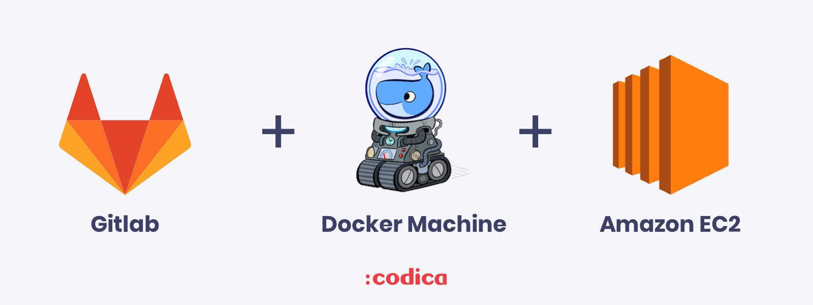

<h1 align="center">Autoscaling GitLab Runner on AWS</h1>



If you want to have a cost-effective and scalable solution for you CI/CD, it can be useful to use Gitlab Runner with its autoscaling feature.
In this example, we'll show how to configure a Gitlab Runner in AWS that will serve as the bastion where it will spawn new Docker machines on demand.

## Prerequisites

We will use such tools as:
* [Gitlab Runner](https://docs.gitlab.com/runner/)
* [Amazon’s EC2 Spot Instances](https://aws.amazon.com/ec2/spot/) 
* [Docker Machine](https://docs.docker.com/machine/drivers/aws/)

## Prepare the bastion instance

The first step is to install GitLab Runner in an EC2 instance that will serve as the bastion that spawns new machines. This doesn’t have to be a powerful machine since it will not run any jobs itself, a t2.micro instance will do. This machine will be a dedicated host since we need it always up and running, thus it will be the only standard cost.

Install the prerequisites:

* Log in to your server
* [Install GitLab Runner from the official GitLab repository](https://docs.gitlab.com/runner/install/linux-repository.html)
* [Install Docker](https://docs.docker.com/install/)
* [Install Docker Machine](https://docs.docker.com/machine/install-machine/)
* [Registering the GitLab Runner](https://docs.gitlab.com/runner/register/)

After the Runner is registered, we need to edit its configuration file and add the required options for the AWS machine driver.

# The Gitlab Runner configuration

## The main section

In the main section, we can define the limit of the jobs that can be run in parallel across all Runners (`concurrent`). We can start with something low like 2, and increase or decrease if we need.

The `check_interval` option defines how often the Runner should check GitLab for new jobs (in seconds).

Example:

```yaml
concurrent = 2
check_interval = 0
```

[Read more](https://docs.gitlab.com/runner/configuration/advanced-configuration.html#the-global-section) about all the options we can use.

## The runners section

From the  `[[runners]]`  section, the most important part is the executor which must be set to docker+machine. Most of those settings are taken care of when you register the Runner for the first time.

 `limit` sets the maximum number of machines (running and idle) that this Runner will spawn. For more info check the relationship between  `limit`, `concurrent` and `IdleCount`.

Example:

```yaml
[[runners]]
  name = "gitlab-aws-autoscaler"
  url = "<URL of your GitLab instance>"
  token = "<Runner's token>"
  executor = "docker+machine"
  limit = 20
```

[Read more](https://docs.gitlab.com/runner/configuration/advanced-configuration.html#the-runners-section) about all the options we can use.

## The runners.docker section

In this section, we can define the default Docker image to be used by the child Runners if it’s not defined in  `.gitlab-ci.yml`. By using `privileged = true`, all Runners will be able to run [Docker in Docker](https://docs.gitlab.com/ee/ci/docker/using_docker_build.html#use-docker-in-docker-executor).
Actually, for build our apps we use Kaniko executor and we dont need to use privileged mode on our docker-machines

Next, we use `disable_cache = true` to disable the Docker executor’s inner cache mechanism since we will use the distributed cache mode as described in the following section.

Example:

```yaml
  [runners.docker]
    tls_verify = false
    image = "alpine"
    privileged = false
    disable_entrypoint_overwrite = false
    oom_kill_disable = false
    disable_cache = true
    shm_size = 0
```

[Read more](https://docs.gitlab.com/runner/configuration/advanced-configuration.html#the-runnersdocker-section) about all the options we can use under `[runners.docker]`.

## The runners.cache section

To speed up our jobs, GitLab Runner provides a cache mechanism. It is recommended to use the distributed cache mechanism that GitLab Runner provides. Since new instances will be created on demand, it is essential to have a common place where the cache is stored.
In next example we dont use ACCESS_KEY or SECRET_KEY. Gitlab-runner will look on our IAM Role on our bastion.
In the following example, we use Amazon S3:

```yaml
 [runners.cache]
    Type = "s3"
    Shared = true
    [runners.cache.s3]
      BucketName = "<the bucket where your cache should be kept>"
      BucketLocation = "us-east-1"
```

## The runners.machine section

This is the most important part of the configuration and it’s the one that tells GitLab Runner how and when to spawn new or remove old Docker Machine instances.

```yaml
  [runners.machine]
    IdleCount = 0
    IdleTime = 120
    MaxBuilds = 100
    MachineDriver = "amazonec2"
    MachineName = "gitlab-docker-machine-%s"
    MachineOptions = [
      "amazonec2-iam-instance-profile=nameOfRole", # For best security features we can use IAM Roles instead of AWS keys
      "amazonec2-region=XXXXX", 
      "amazonec2-vpc-id=vpc-XXXXX", 
      "amazonec2-subnet-id=subnet-XXXXX", 
      "amazonec2-zone=a", 
      "amazonec2-tags=runner-manager-name,gitlab-aws-autoscaler,gitlab,true,gitlab-runner-autoscale,true", 
      "amazonec2-security-group=XXXXX", 
      "amazonec2-instance-type=t3.medium", 
      "amazonec2-request-spot-instance=true", 
      "amazonec2-spot-price=0.03"
      ]
    OffPeakPeriods = ["* * 0-8,22-23 * * mon-fri *", "* * * * * sat,sun *"]
    OffPeakTimezone = "Europe/Kiev"
    OffPeakIdleCount = 0
    OffPeakIdleTime = 120
```

[Read more](https://docs.gitlab.com/runner/configuration/runner_autoscale_aws/#the-runnersmachine-section) about MachineOptions.

## Use IAM Roles instead of AWS_SECRET_KEY and AWS_ACCESS_KEY

Firstly, we need to create `IAM Role` for out bastion server. Below you can see which permissions for IAM Role you need.  
[Read more about IAM Roles](https://docs.aws.amazon.com/IAM/latest/UserGuide/id_roles.html) . 
Example for creating EC2-spot instances(it uses on `bastion server`):
```json
{
    "Version": "2012-10-17",
    "Statement": [
        {
            "Action": [
                "ec2:DescribeKeyPairs",
                "ec2:TerminateInstances",
                "ec2:StopInstances",
                "ec2:StartInstances",
                "ec2:RunInstances",
                "ec2:RebootInstances",
                "ec2:CreateKeyPair",
                "ec2:DeleteKeyPair",
                "ec2:ImportKeyPair",
                "ec2:Describe*",
                "ec2:CreateTags",
                "ec2:RequestSpotInstances",
                "ec2:CancelSpotInstanceRequests",
                "ec2:DescribeSubnets",
                "ec2:AssociateIamInstanceProfile"
            ],
            "Effect": "Allow",
            "Resource": "*"
        },
        {
            "Action": [
                "iam:PassRole"
            ],
            "Effect": "Allow",
            "Resource": "*",
            "Condition": {
                "IpAddress": {
                    "aws:SourceIp": "<use your EIP on bastion>" # It is means what you can use iam:PassRole only from your IP.
                }
            }
        }
    ]
}
```
Next step, you need to create IAM Role for your runners. Your permissions will depends on your CI/CD process.  
Below, permission for our runners with our CI/CD process:
```json

{
  # This permission we are using for UpdateService in deploy stage in our CI/CD process.
    "Version": "2012-10-17",
    "Statement": [
        {
            "Effect": "Allow",
            "Action": [
                "ecs:UpdateService"
            ],
            "Resource": [
                "arn:aws:ecs:region:account-id:service/name_of_cluster/name_of_service",
                "arn:aws:ecs:region:account-id:service/name_of_cluster/name_of_service",
                "arn:aws:ecs:region:account-id:service/name_of_cluster/name_of_service",
                "arn:aws:ecs:region:account-id:service/name_of_cluster/name_of_service",
                "arn:aws:ecs:region:account-id:service/name_of_cluster/name_of_service",
                "arn:aws:ecs:region:account-id:service/name_of_cluster/name_of_service"
            ]
        }
    ]
}
```
Push policy uses for `push our image to ECR repositories`:
```json
{
    "Version": "2012-10-17",
    "Statement": [
        {
            "Effect": "Allow",
            "Action": [
                "ecr:CompleteLayerUpload",
                "ecr:UploadLayerPart",
                "ecr:InitiateLayerUpload",
                "ecr:BatchCheckLayerAvailability",
                "ecr:PutImage",
                "ecr:GetDownloadUrlForLayer",
                "ecr:BatchGetImage"
            ],
            "Resource": [
                "arn:aws:ecr:region:account-id:repository/name_of_repo",
                "arn:aws:ecr:region:account-id:repository/name_of_repo",
                "arn:aws:ecr:region:account-id:repository/name_of_repo",
                "arn:aws:ecr:region:account-id:repository/name_of_repo"
            ]
        },
        {
            "Action": [
                "ecr:GetAuthorizationToken"
            ],
            "Effect": "Allow",
            "Resource": "*"
        }
    ]
}
```
Policy for Describe Target Health on our `ELB`:
```json
{
    "Version": "2012-10-17",
    "Statement": [
        {
            "Effect": "Allow",
            "Action": "elasticloadbalancing:DescribeTargetHealth",
            "Resource": "*"
        }
    ]
}
```

## Getting it all together

Here’s the full example of `/etc/gitlab-runner/config.toml`:

```yaml
concurrent = 10
check_interval = 0

[[runners]]
  name = "gitlab-aws-autoscaler"
  url = "<URL of your GitLab instance>"
  token = "<Runner's token>"
  executor = "docker+machine"
  limit = 20
  [runners.cache]
    [runners.cache.s3]
      BucketName = "<the bucket where your cache should be kept>"
      BucketLocation = "us-east-1"
  [runners.docker]
    tls_verify = false
    image = "alpine"
    privileged = false
    disable_entrypoint_overwrite = false
    oom_kill_disable = false
    disable_cache = true
    shm_size = 0
  [runners.machine]
    IdleCount = 0
    IdleTime = 120
    MaxBuilds = 100
    MachineDriver = "amazonec2"
    MachineName = "gitlab-docker-machine-%s"
    MachineOptions = [
      "amazonec2-iam-instance-profile=nameOfRole",
      "amazonec2-region=XXXXX", 
      "amazonec2-vpc-id=vpc-XXXXX", 
      "amazonec2-subnet-id=subnet-XXXXX", 
      "amazonec2-zone=a", 
      "amazonec2-tags=runner-manager-name,gitlab-aws-autoscaler,gitlab,true,gitlab-runner-autoscale,true", 
      "amazonec2-security-group=XXXXX", 
      "amazonec2-instance-type=t3.medium", 
      "amazonec2-request-spot-instance=true", 
      "amazonec2-spot-price=0.03"
      ]
    OffPeakPeriods = ["* * 0-8,22-23 * * mon-fri *", "* * * * * sat,sun *"]
    OffPeakTimezone = "Europe/Kiev"
    OffPeakIdleCount = 0
    OffPeakIdleTime = 120
```

[Read the official documentation](https://docs.gitlab.com/runner/configuration/runner_autoscale_aws/#introduction) about Autoscaling GitLab Runner on AWS.

## License

Copyright © 2015-2022 Codica. It is released under the [MIT License](https://opensource.org/licenses/MIT).

## About Codica

[](https://www.codica.com)

The names and logos for Codica are trademarks of Codica.

We love open source software! See [our other projects](https://github.com/codica2) or [hire us](https://www.codica.com/) to design, develop, and grow your product.
